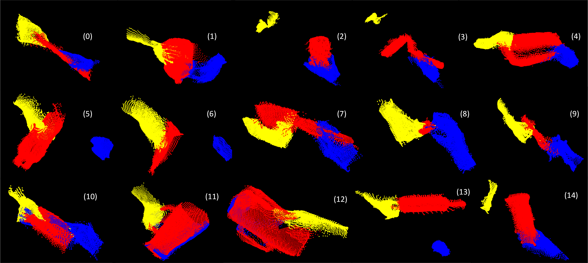

# Hand Pose Estimation (HPE) of Dyadic Human‑Object‑Human Point Cloud



## Overview

This repository contains code and data preparation scripts for estimating 3D hand poses from point cloud representations of handover interactions. We focus on the Human‑Object‑Human (HOH) dataset and the DexYCB dataset, providing a processing pipeline, evaluation tools and visualization scripts. The aim is to facilitate research on hand pose estimation for human–robot handover tasks.

## Key Features

- Extraction of hand and object point clouds from multi‑modal HOH recordings.
- Preparation of DexYCB dataset including MANO hand models and object meshes.
- Pre‑trained models and evaluation scripts for hand pose estimation (HPE) on HOH and DexYCB.
- Scripts to visualise point clouds and 3D hand joint predictions.

## Table of Contents

1. [Dataset Setup](#dataset-setup)
2. [Dependencies and Installation](#dependencies-and-installation)
3. [Data Preparation](#data-preparation)
4. [Running Evaluations](#running-evaluations)
5. [Visualization](#visualization)
6. [Sample Data Format](#sample-data-format)
7. [License](#license)

## Dataset Setup

### HOH Dataset

The HOH (Human‑Object‑Human) dataset contains multi‑view RGB and depth data of two‑person handover interactions. To use this dataset:

1. Download the HOH dataset from the official repository:
   <https://github.com/Terascale-All-sensing-Research-Studio/HOHDataset?tab=readme-ov-file>.
2. Place each downloaded `pcfiltered` zip file (for example `01638-46157-S1_pcfiltered.zip`) into `data/HOH/pcfiltered/`.
3. Extract the point clouds into a usable format by running:

   ```bash
   python3 data/HOH/extract_hoh_data.py
   ```

This script will unpack the point clouds and calibration files into `data/HOH/filtered/` and organise the handover sessions into `train/validation/test` splits.

### DexYCB Dataset

For the DexYCB dataset you need the MANO hand model and the object meshes:

1. Download the MANO hand model archive (`mano_v1_2.zip`) from the MANO website and place it under `data/DexYCB/`. Unzip it:

   ```bash
   cd data/DexYCB
   unzip mano_v1_2.zip
   ```

2. Download the DexYCB dataset using the provided script (this requires a few GB of disk space):

   ```bash
   python3 data/DexYCB/dexycb_download.py
   ```

3. Compile the dataset assets (meshes, camera parameters, etc.):

   ```bash
   python3 data/DexYCB/compile_asset.py
   # or run the helper script
   ./data/DexYCB/compile_assets.sh
   ```

4. From the DexYCB website, download the archives `calibration.tar.gz`, `bop.tar.gz` and `models.tar.gz`, then extract them into the `data/DexYCB/` directory.

### Additional Data

A small preprocessed sample dataset is provided for quick experimentation. Download `data.zip` from the following Google Drive link:

<https://drive.google.com/file/d/151iVtflMms-icXmLNNAN8gP10rgjsywh/view?usp=share_link>

After downloading, unzip the archive into the repository root so that the contents appear under `data/`.

## Dependencies and Installation

This repository uses **Python 3.8+**. Install the base Python dependencies with:

```bash
pip install -r requirements.txt
```

Some evaluation scripts depend on external toolkits which must be cloned into the `dependencies/` folder. You can either run the helper script or clone them manually.

### Using the helper script

```bash
python3 get_dependency.py
```

This will download and extract a pre‑packaged set of dependencies into `dependencies/`.

### Manual installation

Clone each dependency into the `dependencies/` folder and rename the directory to include a `@` prefix:

```bash
cd dependencies
git clone https://github.com/thodan/bop_toolkit.git           # rename to @bop_toolkit
git clone https://github.com/versatran01/dex-ycb-toolkit.git  # rename to @dex-ycb-toolkit
git clone https://github.com/eth-siplab/freihand.git          # rename to @freihand
git clone https://github.com/hassony2/manopth.git             # rename to @manopth
```

After cloning, update the paths in `config/dependency_config.py` if necessary and add each package to your `PYTHONPATH`:

```bash
export PYTHONPATH=$PYTHONPATH:/path/to/HPE-PointCloud/dependencies/@bop_toolkit
export PYTHONPATH=$PYTHONPATH:/path/to/HPE-PointCloud/dependencies/@dex-ycb-toolkit
export PYTHONPATH=$PYTHONPATH:/path/to/HPE-PointCloud/dependencies/@freihand
export PYTHONPATH=$PYTHONPATH:/path/to/HPE-PointCloud/dependencies/@manopth
```

On Linux/macOS you can add these lines to your `.bashrc` or `.zshrc` to set them automatically.

## Data Preparation

Once the datasets and dependencies are in place, prepare the HOH point clouds by running:

```bash
python3 data/HOH/extract_hoh_data.py
```

This will create a structured directory under `data/HOH/filtered/` containing the giver hand, receiver hand and object point clouds alongside the camera intrinsics and MANO parameters.

For DexYCB, the download and compilation scripts described above will prepare the dataset for evaluation.

## Running Evaluations

We provide evaluation scripts for both datasets. These scripts assume that the environment variables `DEX_YCB_DIR` and `HOH_ROOT` point to the DexYCB and HOH data directories respectively.

### DexYCB Evaluation

To evaluate a predicted results file on DexYCB, run:

```bash
export DEX_YCB_DIR=/path/to/data/DexYCB   # adjust this path
python3 evaluation/dexycb_eval.py \
    --eval_type hpe \
    --res_file evaluation/dexycb_sample_results/example_results_hpe_s0_test.txt \
    --out_dir evaluation/dexycb_sample_results/ \
    --visualize
```

The evaluator will compute standard metrics and optionally visualise the joint predictions.

### HOH Evaluation

For HOH, the evaluation differs by hand type (giver or receiver). Provide the appropriate results file:

```bash
export HOH_ROOT=/path/to/data/HOH
```

#### Evaluate the giver hand

```bash
python3 evaluation/hoh_eval.py \
    --hand_type giver \
    --res_giver_file evaluation/hoh_eval_results/giver_hpe_predicted_results_test.txt
```

#### Evaluate the receiver hand

```bash
python3 evaluation/hoh_eval.py \
    --hand_type receiver \
    --res_receiver_file evaluation/hoh_eval_results/receiver_hpe_predicted_results_test.txt
```

The evaluator will output joint error metrics and optionally visualise the predicted poses.

## Visualization

Several scripts are provided to visualise point clouds and hand poses:

- `visualization/pc_visualization.py` — combines multiple `.ply` files (giver hand, object and receiver hand) and displays them using Open3D.
- `visualization/giver_hand_pose.py` — plots the default MANO joint positions for a giver hand in 3D using Matplotlib.
- `visualization/giver_reciever.py` — overlays giver and receiver poses to compare hand configurations.

These scripts are stand‑alone and can be run directly once the dependencies (`open3d`, `matplotlib`, `numpy`) are installed.

## Sample Data Format

Processed HOH frames are stored as Python dictionaries in `.npz` files. Each dictionary contains metadata and MANO parameters for either the giver or receiver. An example entry looks like:

```python
{
    'subject': '7',
    'frame': 'frame9173',
    'giver': {
        'intrinsics': {'fx': 918.53, 'fy': 917.32, 'ppx': 957.76, 'ppy': 549.78},
        'hoh_ids': [7, 0, 0, 0],
        'hoh_grasp_ind': 0,
        'mano_side': 'right',
        'mano_betas': [[-1.07, -1.16, -1.02, -0.94, 1.00, 1.01, 0.96, -1.01, -0.98, -1.14]],
        'label_file': 'data/HOH/calibration/labels/7/giver_frame9173.npz'
    },
    'receiver': None,
    'file': 'giver_frame9173.ply'
}
```

Similar structures exist for receiver frames with the roles reversed. Refer to the `data/HOH` directory after running the extraction script for more examples.

For testing and visualisation, we define default MANO joint coordinates in the visualization scripts. See the commented arrays in this README or in `visualization/constant.py` for sample coordinate values.

## License

This project is licensed under the MIT License – see the `LICENSE` file for details.

The HOH and DexYCB datasets may have additional restrictions; consult their respective repositories for terms of use.

[1] GitHub - htella26/HPE-PointCloud.
